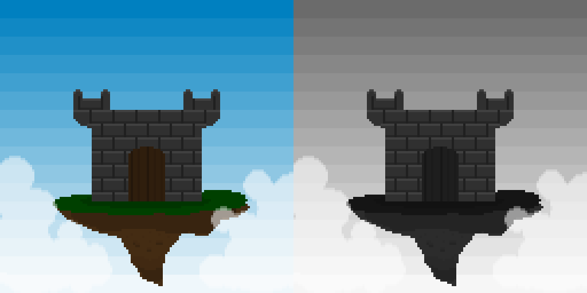
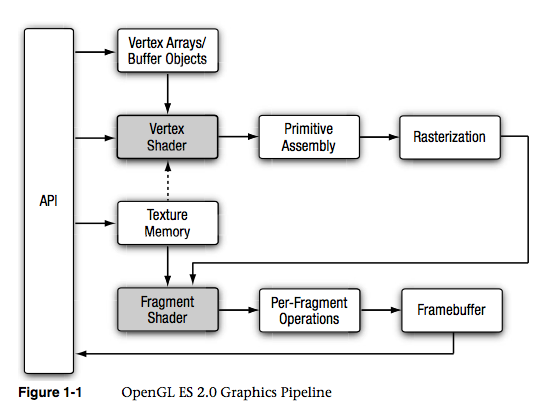
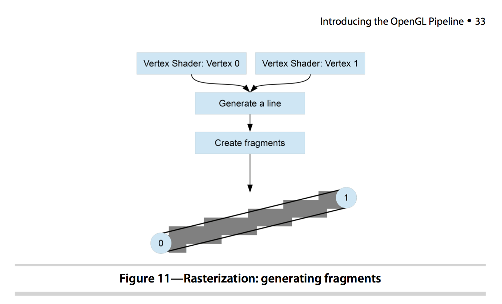
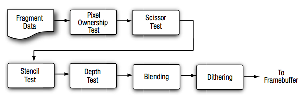
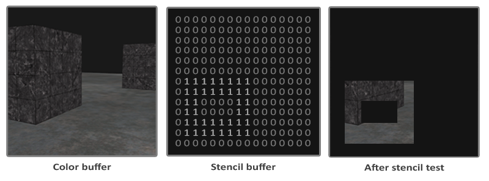
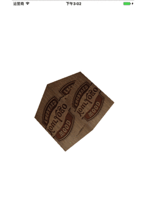
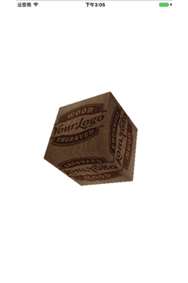

# 平台研发部-OpenGLES入门系列分享-基础知识

## 导语

####OpenGLES 1.0 和 OpenGLES 2.0

第一件你需要搞清楚的事，是OpenGL ES 1.0 和 2.0的区别。

* *OpenGLES 1.0*：

针对固定管线硬件(fixed pipeline)，通过它内建的函数来设置诸如灯光、，vertexes（图形的顶点数），颜色、camera等等的东西。

*  *OpenGLES 2.0*：

针对可编程管线硬件(programmable pipeline)，基于这个设计可以丢弃内建函数，但同时你得自己动手编写任何功能。

你可能会这么想，2.0使用起来这么麻烦我为什么还要用它？ 但2.0确实能做一些很Cool很简单而1.0不能做的事情。例如在顶点脚本做顶点变换、片段脚本做逐个像素的处理。

## 预备知识

* **渲染管线**

在 *OpenGLES* 1.0 版本中，支持固定管线，而 *OpenGLES* 2.0 版本不再支持固定管线，只支持可编程管线。什么是管线？什么又是固定管线和可编程管线？管线（**pipeline**）也称渲染管线，因为*OpenGLES*在渲染处理过程中会顺序执行一系列操作，这一系列相关的处理阶段就被称为*OpenGLES*渲染管线。pipeline 来源于生产车间的流水线作业，在*OpenGLES* 渲染过程中也是一样，一个操作接着一个操作进行，就如流水线作业一样，这样的实现极大地提供了渲染的效率。整个渲染管线如下图所示：

图中阴影部分的 *Vertex Shader* 和 *Fragment Shader* 是可编程管线。可编程管线就是说这个操作可以动态编程实现而不必固定写死在代码中。

可动态编程实现这一功能一般都是脚本提供的，在*OpenGLES* 中也一样，编写这样脚本的能力是由着色语言(**Shader Language**)提供的。那可编程管线有什么好处呢？方便我们动态修改渲染过程，而无需重写编译代码，当然也和很多脚本语言一样，调试起来不太方便。

**Vertex Array/Buffer objects**：顶点数据来源，这时渲染管线的顶点输入，通常使用 Buffer objects效率更好。在今天的示例中，简单起见，使用的是 Vertex Array；

**Vertex Shader**：顶点着色器通过可编程的方式实现对顶点的操作，如进行坐标空间转换，计算 per-vertex color以及纹理坐标；

**Primitives**：在 *OpenGLES* 的世界里，我们只能画**点、线、三角形**这三种基本图形，而其它复杂的图形都可以通过三角形来组成。所以这里的图元指的就是这三种基础图形：

- **点**：点存在于三维空间，坐标用（x,y,z）表示。(实际上还需要一个齐次坐标的维度，后面会介绍)

- **线**：由两个三维空间中的点组成。
- **三角形**：由三个三维空间的点组成。

**Primitive Assembly**：图元装配，经过着色器处理之后的顶点在图片装配阶段被装配为基本图元。OpenGL ES 支持三种基本图元：点，线和三角形，它们是可被*OpenGLES* 渲染的。

接着对装配好的图元进行裁剪(**clip**)：保留完全在视锥体中的图元，丢弃完全不在视锥体中的图元，对一半在一半不在的图元进行裁剪；接着再对在视锥体中的图元进行剔除处理(**cull**)：这个过程可编码来决定是剔除正面，背面还是全部剔除。

在介绍**Rasterization**之前，首先来补充 *OpenGLES*中的两个非常重要的概念：

**Rasterization**：光栅化。在光栅化阶段，基本图元被转换为二维的片元(fragment)，fragment 表示可以被渲染到屏幕上的像素，它包含位置，颜色，纹理坐标等信息，这些值是由图元的顶点信息进行插值计算得到的。这些片元接着被送到片元着色器中处理。这是从顶点数据到可渲染在显示设备上的像素的质变过程。 也是为什么我们在绘制斜线的时候会出现锯齿的原因。

**Fragment Shader**：片元着色器通过可编程的方式实现对片元的操作。在这一阶段它接受光栅化处理之后的fragment，color，深度值，模版值作为输入。

* **Per-Fragment Operation**

在这一阶段对片元着色器输出的每一个片元进行一系列测试与处理，从而决定最终用于渲染的像素。这一系列处理过程如下：

 

**Pixel ownership test**：该测试决定像素在 framebuffer 中的位置是不是为当前 OpenGL ES 所有。也就是说测试某个像素是否对用户可见或者被重叠窗口所阻挡。

**Scissor Test**：剪裁测试，判断像素是否在由 glScissor 定义的剪裁矩形内，不在该剪裁区域内的像素就会被剪裁掉。

**Stencil Test**：模版测试，将模版缓存中的值与一个参考值进行比较，从而进行相应的处理。

**Depth Test**：3D 渲染时，最后的渲染目标是二维的屏幕，因此如何判读物体之间的遮挡与投影是一个重要的问题，在 *OpenGL ES*中都是通过深度测试来判断物体的前后遮挡关系。

**Blending**：混合，混合是将片段的颜色和帧缓冲区中已有的颜色值进行混合，并将混合所得的新值写入帧缓冲。常见于绘制带有透明通道的图片。

**[Dithering](http://www.blueidea.com/design/pixel/2008/5337.asp)**：抖动，抖动是使用有限的色彩让你看到比实际图象更多色彩的显示方式，以缓解表示颜色的值的精度不够大而导致的颜色剧变的问题。

**Framebuffer**：这是流水线的最后一个阶段，Framebuffer 中存储这可以用于渲染到屏幕或纹理中的像素值，也可以从Framebuffer 中读回像素值，但不能读取其他值（如深度值，模版值等）。

- **EGL**

EGL 是 *OpenGL ES* 渲染 API 和本地窗口系统(native platform window system)之间的一个中间接口层，它主要由系统制造商实现。EGL提供如下机制：

- 与设备的原生窗口系统通信
- 查询绘图表面的可用类型和配置
- 创建绘图表面
- 在OpenGL ES 和其他图形渲染API之间同步渲染
- 管理纹理贴图等渲染资源

为了让*OpenGL ES*能够绘制在当前设备上，我们需要EGL作为*OpenGL ES*与设备的桥梁。（在iOS平台上，Apple封装了EGL并使其更为易用，并且将其命名为EAGL）

## 关键内容解释

* **glClear**

*glClear*用于清空当前framebuffer的color、depth、stencil内容，一般每一次绘制建议都进行一次清空操作，否则可能出现花屏、闪烁或者意料之外的内容。用于验证gl环境搭建是否成功也是很有帮助的。

* **GL坐标系**

*OpenGLES*的坐标原点(0,0)为屏幕中心，左下角为-1，-1，右上角为1，1。由于它的宽高已经归一化了，所以决定它的像素大小是由**glViewport**函数决定。如果不对其进行设置，默认宽高为0。这也是常见的，使用*glClear*可以刷新颜色但是无法绘制内容的原因。

* **renderbuffer**

renderbuffer一般用作深度与模板测试的结果载体而存在，另外在iOS上用于与屏幕视图做绑定。

* **framebuffer**

*framebuffer*可以理解为画布，我们调用gl函数的绘制结果都将绘制到*framebuffer*。*framebuffer*的绘制结果将存储在它的GL_COLOR_ATTACHMENT0，一般绑定在上面的只有两种对象一个是*texture*，另外一个是*renderbuffer*。前者作用于离屏渲染，后者在iOS上用于绑定到屏幕视图（安卓创建EGLContext的Surface会创建两个双缓冲framebuffer，所以在安卓上GL_COLOR_ATTACHMENT0只用于离屏渲染。）

* **swapToScreen** 

所有的gl指令调用完毕后需要调用swapToScreen指令通知屏幕更新，否则绘制的内容无法正常显示到界面。（iOS为EAGLContext的presentRenderbuffer:函数，安卓为eglSwapBuffers函数）