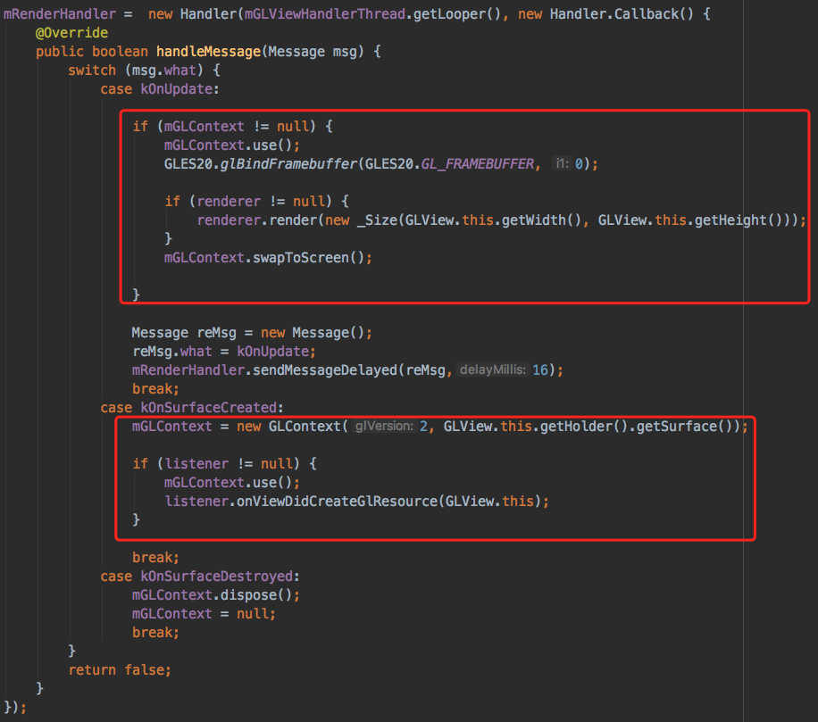

#0x00 第一课：创建一个由自己掌控渲染的View 
<!--如何接管Android和iOS的View的渲染-->
<!--没带电脑不准上课-->

- [**导语** ](#2)
- [**展示GL View**](#6)
	- [**Android**](#4)
	- [**iOS**](#5)

## 导语

#欢迎大家来到第一课！

#OpenGL还算庞大的知识体系图，了解一下！

 

  

  		

###看来需要准备点预备知识，不然上课怎么听得懂，去买了本书看吧 

 

###然后就……没有然后了

#本课程 <mark>不需要</mark> <del>特别的预备知识</del>。
如果学过编程语言（C、Java、Lisp、Javascript等），理解起课程代码来会快一些；但这并非必需的；如果没有编程经验，那也不要紧，只不过是同时学习两样东西（编程语言+OpenGL）而已。

为了让代码尽量简单，采用“C++”编写了课程核心代码。也就是说，即使只懂Java也能理解所有内容。

#在学习OpenGL之前，我们将先学习如何生成，运行，和玩转课程中的代码。

 

## 展示OpenGL ES View

 - 为了提高课程效率 
   
   [下载公用代码](http://techgit.meitu.com/wzq/OpenGLESLesson)
   
	- GLContext 上下文
	- GLProgram 着色器程序
	- Renderer 渲染类
   - gl.h、platform.h 平台相关宏定义
   
	目前先别管什么是Context、Program、Renderer

### Android

- 创建一个新的工程

  - 工程的类是由C++实现的，勾选

  

  为了防止JNI函数调用失败 Company domain

  ###直接运行工程，Hello from c++

  

  ####事前准备

  - 为了提高效率公用代码中的Android_Java内的文件拖入工程中
    
    JNI在Java层的调用接口

    

  - CMakeLists.txt中编译JNI文件
    
     编译JNI文件、链接GL相关的库
     
     主编需要注意的是 

   

  ​	
  ​	

- 先创建一个View吧

	
	
	- 添加初始化方法

		
	
	- 加载View 
		
	
	- 在初始化方法里面实现
	   - SurfaceView的回调对象设为自己
			
		  实现SurfaceView回调
		  
	   
	   - 创建一个HandlerThread渲染线程

	  	  
	   
	   - 在RenderHandler中对应消息的实现

	     
	   
	   - kOnSurfaceCreated初始化GL资源完成需要声明回调
	     
	   
	   这样GLView就构建完成了
     
      
     
	- 添加回调，初始化ClearColor渲染器
	     		   
		
###不出意外，运行后手机应该是会出现红色背景

### iOS

 

   - 创建一个新的工程

	 

   - 将GL公用类添加到项目中
	  这里iOS工程中不需要Android的文件夹，删除即可
	
	 
	
    ####准备就绪。
    
     <!--OpenGL ES (OpenGL for Embedded Systems) 为嵌入式设备设计的接口-->

- 我们创建一个继承于UIView的类，然后修改其Layer类型

	
		
	###为什么呢?
	
	#####总所周知，UIView 表示屏幕上的一块矩形区域，负责渲染区域的内容，并且响应该区域内发生的触摸事件。
	
	#####而负责渲染内容是由 CALayer

   - **EGL**

	EGL 是 *OpenGL ES* 渲染 API 和本地窗口系统(native platform window system)之间的一个中间接口层，它主要由系统制造商实现。EGL提供如下机制：

	- 与设备的原生窗口系统通信
	- 查询绘图表面的可用类型和配置
	- 创建绘图表面
	- 在OpenGL ES 和其他图形渲染API之间同步渲染
	- 管理纹理贴图等渲染资源

	为了让*OpenGL ES*能够绘制在当前设备上，我们需要EGL作为*OpenGL ES*与设备的桥梁。（在iOS平台上，Apple封装了EGL并使其更为易用，并且将其命名为EAGL）

​	
###因为要和C++混编先把GLView文件改成.mm 	  
- 重写UIView的初始化方法
  - 初始化GL上下文
  - 刷新屏幕的定时器
  	
  	

- 重写Layout
	- 视图在重新布局的时候会改变，GL资源也要相对应的重建
    
     	
	
     

- 更新GL内容
	
	
	 
    

###运行一下如果不出意外的话应该是个 黑屏【真机情况下】
###因为这里没有设置渲染器

- 我们为GLView增加一个协议
  

- 添加GL资源创建完后的回调

  

- 最后就可以展示你所创建的GLView了 【VC也要改成.mm】

  - 初始化ClearColor的渲染器，其颜色为1,0,0,1

 

###运行一下，一个红色界面就展示出来了

