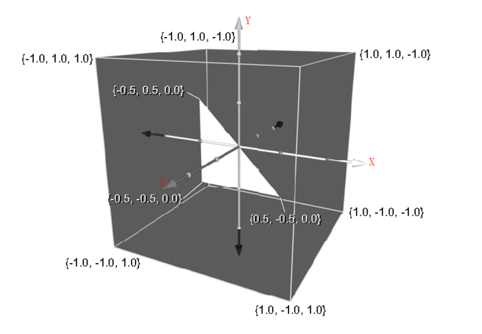
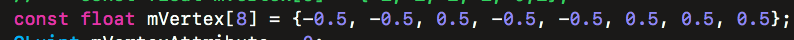
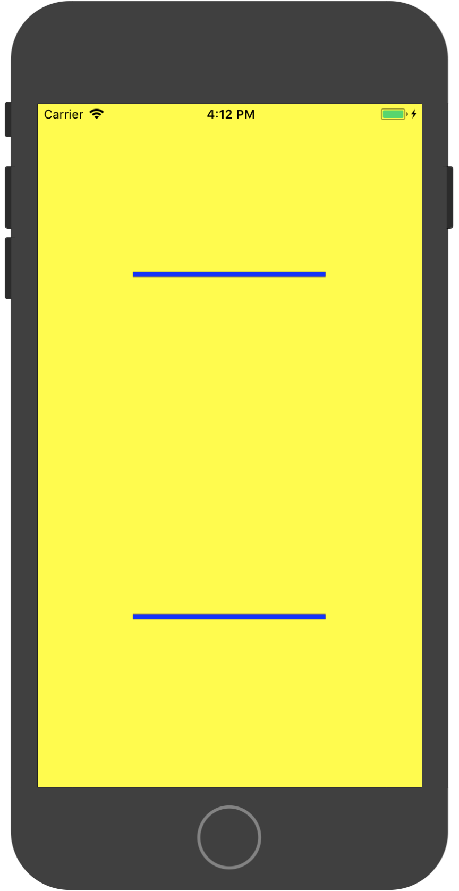

#0x01 第二课： 在View上大展身手
<!--顶点属猪对象-->
<!--增加互动，请求台下观众上来实践-->

- [**第二课** ](#2)
- [**绘制图元**](#6)
	- [**屏幕坐标系**](#5)
	- [**顶点数组对象**](#4) <!--VAO、VBO 和常用的 glVertexAttribPointer的比较-->
   - [**点**](#5) 
   - [**线**](#5)<!--GL_LINES线段、 GL_LINE_STRIP多线段、GL_LINE_LOOP线圈-->
	- [**三角形**](#5)<!--GL_TRIANGLES三角形、GL_TRIANGLE_STRIP三角带、GL_TRIANGLE_FAN 三角扇形-->
	- [**绘制方式**](#5)

- [**着色器（Shader）**](#5)
	- [**编译着色器**](#5)
	- [**顶点着色器**](#5)
	- [**片段着色器**](#5)

- [**结果**](#5)

## 绘制图元

#欢迎大家来到第二课！

###我们已经踏出了第一步，真正好玩的才刚刚开始

  		
#先让我们了解下屏幕坐标系

-  OpenGL ES 的坐标系在屏幕上的分布
 
	

  三维坐标系 {x, y, z}
  
  三维坐标中心在正方体的几何中心 {0， 0， 0}
  
  坐标系的区间是[-1, 1]
  
  拿起你 <mark>右手</mark> 拇指朝右，食指朝上，中指朝内就形成了OpenGL ES坐标系

###让我们先展示个三角形，加深下理解

  - 别忘记我们上节课的工程，打开在各平台的控制器中的didCreateGLResource协议方法替换掉渲染器

	

	

	运行后你会看到一个平面坐标的坐标轴、中心点和一个三角形【安卓结果一样】
	
	

  - 接下来我们修改下三角形的顶点坐标
	  
	打开Renderer.hpp 
	
	
  
	 <!--问题 ：为什么图上显示 坐标是4位，而这一个顶点的坐标只有两位 
	 	回答：glVertexAttribPointer的参数-->
	
	###Run一下 直观感受下顶点位置和下图一样的三角形
	
	

	

#顶点数组对象

###上面我们通过修改 <mark>mVertex[6]</mark> 这个数据修改了三角形的绘制位置
这个数据是使用 `glVertexAttribPointer (GLuint indx, GLint size, GLenum type, GLboolean normalized, GLsizei stride, const GLvoid* ptr)` 这个方法将绘制数据传给GPU的

###该种方式称为VAO(vertex array object)
####除此之外,还有一种数据存储方式,顶点缓冲区对象VBO(vertex buffer object)
[有兴趣同学自行了解]
顶点数组数据保存在客户内存中，使用`glDrawArrays`或`glDrawElements`绘图时，这些数据必须从客户内存复制到图形内存，如果数据过大或者频繁绘图时，将带来性能问题，于是引入了VBO，在图形内存中分配和缓冲顶点数据并且进行渲染，这样可以提高渲染性能，降低内存带宽和电力消耗，不仅是顶点数据，描述图元顶点的索引、作为glDrawElements参数传递的元素索引也可以缓存。

#图元
###OpenGL ES的基本图元有 点（Point）线（Line）三角形（Triangle）
####点可以组成线
####线可以组成三角形
####三角形可以组成任意多边形

##点

 - “点”称为顶点（Vertex），通常用一个形如（x, y, z）的三维坐标值表示。

 - 有时候会采用齐次坐标表示，就是一个形如（x, y, z, w）的四元组，可以这样理解这个四元组，前面的（x,y,z）表示“点”所在的方向，而w表示在该方向上的距离比例，所以（x, y, z, w）表示的实际坐标值就是（x/w, y/w, z/w）坐标点。如果w为0，则表示方向为（x, y, z）的无穷远点；如果w＝10，表示取（x,y,z）的十分之一作为坐标点（x/10,y/10,z/10）。

 
	
一般情况 下,点被画成单个的像素。实际上点还可以更小，虽然它可能足够小,但并不会是无穷小，一个像素内可以描绘多个点，取决于对点大小的设定，默认一个点的大小为一个像素。

	
 - 同样，加载PointRenderer

	
	
	
	设置PointSize
		
	
	
	
	结果    
	
	

##线
    
  - `GL_LINES` 多条线，两点确定一条直线，顶点不足则不绘制
   
  - `GL_LINE_LOOP` 指首尾相接的线段，第一条线和最后一条线没有连接在一起；

  - `GL_LINE_STRIP` 指首尾相接的线段，第一条线和最后一条线连接在一起，即闭合的曲线；

  - 不同模式下的绘制方式

	
	  
  - 把渲染器替换成 LineRenderer 

 	
	
	确定3个顶点、设置线宽、绑定数据、绘制
	  
	
	
	得到结果图如下，大家觉得有问题吗 ？
	<!--添加顶点和 glDraw的顶点个数-->
	
	
 	
 	修改顶点后 
 		
 	

 	
 	`GL_LINES`
 	
   
   
   `GL_LINE_LOOP`
   
   
   
   `GL_LINE_STRIP`
   
   
   
##三角形

`GL_TRIANGLES` 三个顶点确定一个三角形，顶点不足则不绘制
	
`GL_TRIANGLE_STRIP` 指条带，相互连接的三角形

`GL_TRIANGLE_FAN` 指扇面，相互连接的三角形
	

- 使用`GL_TRIANGLES` 来绘制长方形需要绘制6个顶点

- 使用`GL_TRIANGLE_STRIP` 和 `GL_TRIANGLE_FAN` 来绘制长方形需要绘制4个顶点

	
##两种绘制函数

`glDrawArrays (GLenum mode, GLint first, GLsizei count)`

- mode 只能是以下几种：GL_POINTS、GL_LINES、GL_LINE_STRIP、GL_LINE_LOOP、GL_TRIANGLES、GL_TRIANGLE_STRIP、GL_TRIANGLE_FAN

- first 数据的起始位置

- count 数据个数

-  只能一个顶点被调度一次

`glDrawElements (GLenum mode, GLsizei count, GLenum type, const GLvoid* indices)`

-  mode 只能是以下几种：GL_POINTS、GL_LINES、GL_LINE_STRIP、GL_LINE_LOOP、GL_TRIANGLES、GL_TRIANGLE_STRIP、GL_TRIANGLE_FAN
- count indices 的数量
- type 下标的数据类型：GL_UNSIGNED_BYTE、GL_UNSIGNED_SHORT、GL_UNSIGNED_INT（它只能在使用了OES_element_index_uint 才能使用）
- indices 下标在内存中的首地址(如果使用了 VBO，就是 GPU 内存中的首地址，若不是，则为 CPU 内存中的首地址)

- 两种绘制方式的区别，修改TriangleRenderer
  
  
  
  
 
  不出意外结果是一样的

####注意在OpenGL ES绘制图形时，可能需要绘制多个并不相连的图形。这样的情况下这几个图形没法被当做一个图形来处理。也就需要多次调用 DrawArrays 或 DrawElements. 如果图形很多，可能会需要用一个循环来调用：每一次调用OpenGL 的绘制函数，都需要一定的资源开销，如果每一帧调用太多次，会对程序的性能产生较大的影响。提高性能的办法就是调用一次绘制函数，画出分散的图形。

