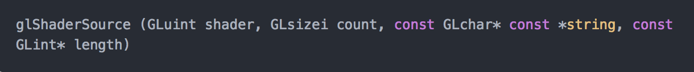

###前情回顾

<!--介绍着色器处于渲染管线处理的位置-->

# 0x01 着色器
## 0x01001 着色器概述

###着色器
- 着色器(Shader)是运行在GPU上的小程序。这些小程序为图形渲染管线的某个特定部分而运行。从基本意义上来说，着色器只是一种把输入转化为输出的程序。着色器也是一种非常独立的程序，因为它们之间不能相互通信；它们之间唯一的沟通只有通过输入和输出。

- 着色器是使用一种叫GLSL的类C语言写成的。GLSL是为图形计算量身定制的，它包含一些针对向量和矩阵操作的有用特性。

###输入与输出

- 顶点着色器 是一个可编程的处理单元，执行顶点变换、纹理坐标变换、光照、材质等顶点的相关操作，每顶点执行一次。替代了传统渲染管线中顶点变换、光照以及纹理坐标的处理。
  
    
  	
  	 

  <!--顶点着色器数据传递，下面详细介绍变量意义-->

  

- 片元着色器 是一个处理片元值及其相关联数据的可编程单元，片元着色器可执行纹理的访问、颜色的汇总、雾化等操作，每片元执行一次。
  
    
    
	 

## 0x0101 着色器GLSL语法

###变量及变量类型

- 在GLSL中不像C语言一样支持`双精度浮点型(double)`、`字节型(byte)`、`短整型(short)`、`长整型(long)`，并且取消了C中的`联合体(union)`、`枚举类型(enum)`、`无符号数(unsigned)`以及`位运算`等特性。 着色语言中有许多内建的原生数据类型以及构建数据类型，如：`浮点型(float)`、`布尔型(bool)`、`整型(int)`、`矩阵型(matrix)`以及`向量型(vec2、vec3等)`等。总体来说，这些数据类型可以分为标量、向量、矩阵、采样器、结构体以及数组等。 shader支持下面数据类型：

	| 变量类别 | 变量类型 | 描述 |
| :------ | ------ | ----- |
| 空       | void | 用于无返回值的函数或空的参数列表|
| 标量     | float, int, bool |浮点型，整型，布尔型的标量数据类型|
| 浮点型向量| vec2, vec3, vec4 |包含2，3，4个元素的浮点型向量|
| 整数型向量| ivec2, ivec3, ivec4 |包含2，3，4个元素的整型向量|
| 布尔型向量| bvec2, bvec3, bvec4 |包含2，3，4个元素的布尔型向量|
| 矩阵| mat2, mat3, mat4 |尺寸为2x2，3x3，4x4的浮点型矩阵|
| 纹理句柄| sampler1D, sampler2D, sampler3D , samplerCube |表示1D, 2D, 立方体纹理的句柄, Cube纹理采样器|

  除上述之外，着色器中还可以将它们构成数组或结构体，以实现更复杂的数据类型。`但是在GLSL中没有指针类型`

###变量构造器及类型转换

- 对于类型转换，OpenGl ES SL中有非常严格的规则，即只有类型一致时，变量才能完成赋值或其它对应的操作。为了实现类型转换，在GLSL中有多重构造器可以使用。构造器可以用来初始化变量，也可以用来在不同类型之间进行转换。使用构造器对变量的初始化可以在声明时进行，也可以稍后在着色器中完成。每种内置的类型都有一些相对应的构造器。

  - 矢量构造器用法

  		~~~
  		vec4 myVec4 = vec4(1.0); // myVec4 = {1.0, 1.0, 1.0, 1.0}
  	vec3 myVec3 = vec3(1.0, 0.0, 0.5); // myVec3 = {1.0, 0.0, 0.5}
  	vec3 temp = vec3(myVec3); // temp = myVec3
  	vec2 myVec2 = vec2(myVec3); // myVec2 = {myVec3.x, myVec3.y}
  	myVec4 = vec4(myVec2, temp, 0.0); // myVec4 = {myVec2.x, myVec2.y , temp, 0.0 }
  	~~~
    
   - 矢量和矩阵的分量

    	单独获得矢量中的组件有两种方法：即使用"."符号或使用数组下标方法。依据构成矢量的组件个数，矢量的组件可以通过{x, y, z, w}，{r, g, b, a}或{s, t, r, q}等swizzle操作来获取。之所以采用这三种不同的命名方法，是因为矢量常常会用来表示数学矢量、颜色、纹理坐标等。其中的x、r、s组件总是表示矢量中的第一个元素，如下表：
    	
  	|  分量访问符| 符号描述   |
  	| :------ | ------   |
  	| (x,y,z,w) | 与位置相关的分量  |
  	| (r,g,b,a)| 与颜色相关的分量   |
  	| (s,t,p,q)| 	与纹理坐标相关的分量  |
  	
  		不同的命名约定是为了方便使用，在使用矢量时不能混用不同的命名约定，即不能使用.xgr这样的方式，每次只能使用同一种命名约定。当使用"."操作符时，还可以对矢量中的元素重新排序，参考以下示例代码：
  	
  	~~~
  	vec3 myVec3 = vec3(0.0, 1.0, 2.0); // myVec3 = {0.0, 1.0, 2.0}
  	vec3 temp;
  	temp = myVec3.xyz; // temp = {0.0, 1.0, 2.0}
  	temp = myVec3.xxx; // temp = {0.0, 0.0, 0.0}
  	temp = myVec3.zyx; // temp = {2.0, 1.0, 0.0}
  	~~~
  	
  	矩阵可以认为是矢量的组合。例如一个mat2可以认为是两个vec2，一个mat3可以认为是三个vec3等等。对于矩阵来说，可以通过数组下标“[]”来获取某一列的值，然后获取到的矢量又可以继续使用矢量的操作方法，可参考以下代码：
  	
  	~~~
  	mat4 myMat4 = mat4(1.0); // Initialize diagonal to 1.0 (identity)
  	vec4 col0 = myMat4[0]; // Get col0 vector out of the matrix 
  	float m1_1 = myMat4[1][1]; // Get element at [1][1] in matrix 
  	float m2_2 = myMat4[2].z; // Get element at [2][2] in matrix
  	~~~
  	
    - 矢量和矩阵的操作
  	
    	绝大多数情况下，矢量和矩阵的计算是逐分量进行的（component-wise）。当运算符作用于矢量或矩阵时，该运算独立地作用于矢量或矩阵的每个分量。
  	以下是一些示例：

  	~~~
  	vec3 v, u;
  	float f;
  	v = u + f;
  	~~~
  	等效于：
  	
  	~~~
  	v.x = u.x + f;
  	v.y = u.y + f;
  	v.z = u.z + f;
  	~~~
  	再如：

  	~~~
  	vec3 v, u, w;
  	w = v + u;
  	~~~
  	等效于：
  	
  	~~~
  	w.x = v.x + u.x;
  	w.y = v.y + u.y;
  	w.z = v.z + u.z;
  	~~~
  	
  	对于整型和浮点型的矢量和矩阵，绝大多数的计算都同上，但是对于矢量乘以矩阵、矩阵乘以矢量、矩阵乘以矩阵则是不同的计算规则。这三种计算使用线性代数的乘法规则，并且要求参与计算的运算数值有相匹配的尺寸或阶数。
  	例如：
  	
     ~~~
  	vec3 v, u;
  	mat3 m;
  	u = v * m;
     ~~~
  	等效于：
  	
  	~~~
  	u.x = c(v, m[0]); // m[0] is the left column of m
  	u.y = dot(v, m[1]); // dot(a,b) is the inner (dot) product of a and b
  	u.z = dot(v, m[2]);
  	~~~
  	再如：
  	
  	~~~	
  	u = m * v;
  	~~~
  	等效于：
  	
  	~~~
  	u.x = m[0].x * v.x + m[1].x * v.y + m[2].x * v.z;
  	u.y = m[0].y * v.x + m[1].y * v.y + m[2].y * v.z;
  	u.z = m[0].z * v.x + m[1].z * v.y + m[2].z * v.z;
  	~~~
  	
  	再如：
  	
  	~~~
  	mat m, n, r;
  	r = m * n;
  	~~~
  	等效于：
  	
  	~~~
  	r[0].x = m[0].x * n[0].x + m[1].x * n[0].y + m[2].x * n[0].z;
  	r[1].x = m[0].x * n[1].x + m[1].x * n[1].y + m[2].x * n[1].z;
  	r[2].x = m[0].x * n[2].x + m[1].x * n[2].y + m[2].x * n[2].z;
  	r[0].y = m[0].y * n[0].x + m[1].y * n[0].y + m[2].y * n[0].z;
  	r[1].y = m[0].y * n[1].x + m[1].y * n[1].y + m[2].y * n[1].z;
  	r[2].y = m[0].y * n[2].x + m[1].y * n[2].y + m[2].y * n[2].z;
  	r[0].z = m[0].z * n[0].x + m[1].z * n[0].y + m[2].z * n[0].z;
  	r[1].z = m[0].z * n[1].x + m[1].z * n[1].y + m[2].z * n[1].z;
  	r[2].z = m[0].z * n[2].x + m[1].z * n[2].y + m[2].z * n[2].z;
  	~~~
  	对于2阶和4阶的矢量或矩阵也是相似的规则。
  - https://blog.csdn.net/sz66cm/article/details/54096201

  - 结构体

    与C语言相似，除了基本的数据类型之外，还可以将多个变量聚合到一个结构体中，下边的示例代码演示了在GLSL中如何声明结构体：

    ~~~
    struct fogStruct
    {
    	vec4 color;
    	float start;
    	float end;
    } fogVar;
    ~~~

    首先，定义会产生一个新的类型叫做fogStruct，及一个名为fogVar的变量。结构体可以用构造器来初始化，在定义了新的结构体之后，还会定义一个与结构体类型名称相同的构造器。构造器与结构体中的数据类型必须一一对应，以下代码演示了之前定义的结构体初始化的构造语法：

    ~~~	
    fogVar = fogStruct(vec4(0.0, 1.0, 0.0, 0.0), // color
                       0.5, // start
       		            2.0); // end
    ~~~

      结构体的构造器是基于类型的名称，以参数的形式来赋值。获取结构体内元素的方法和C语言中一致：

    ~~~
    vec4 color = fogVar.color;
    float start = fogVar.start;
    float end = fogVar.end;
    ~~~

  

  - 数组
    除了结构体制外，GLSL中还支持数组。 语法与C语言相似，创建数组的方式如下代码所示：	 

    ~~~
    float floatArray[4];
    vec4 vecArray[2];
    ~~~

### 存储限定符

- 在声明变量时，应根据需要使用存储限定符来修饰，GLSL中支持的存储限定符见下表： 

| 限定符 | 描述 |
| ------ | ------ |
| < none: default > | 局部可读写变量，或者函数的参数 |
| const | 编译时常量，或只读的函数参数 |
| attribute | 由应用程序传输给顶点着色器的逐顶点的数据 |
| uniform | 在图元处理过程中其值保持不变，由应用程序传输给着色器 |
| varying | 由顶点着色器传输给片段着色器中的插值数据 |
| samplers | 一种特殊的 uniform，用途呈现纹理|

	- **const 限定符**
	
		任意基础类型的变量都可以声明为常量。常量表示这些变量中的值在着色器中不会发生变化，声明常量只需要在声明时加上限定符const即可，声明时必须赋初值。
	 
	    ~~~
		const float zero = 0.0;
		const float pi = 3.14159;
		const vec4 red = vec4(1.0, 0.0, 0.0, 1.0);
		const mat4 identity = mat4(1.0);
	    ~~~
			
	 常量声明过的值在代码中不能再改变，这一点和C语言或C++一样。
结构体成员不能被声明为常量，但是结构体变量可以被声明为常量，并且需要在初始化时使用构造器初始化其值。
常量必须被初始化为一个常量表达式。数组或者包含数组的结构体不能被声明为常量（因为数组不能在定义时被初始化）。

	- **attribute 限定符**
	
		GLSL中另一种特殊的变量类型是attribute变量。attribute变量只用于顶点着色器中，用来存储顶点着色器中每个顶点的输入（per-vertex inputs）。attribute通常用来存储位置坐标、法向量、纹理坐标和颜色等。注意attribute是用来存储单个顶点的信息。以下是有位置坐标和纹理坐标attribute的顶点着色器用例：
	
		~~~
		uniform mat4 u_matViewProjection;
		attribute vec4 a_position;
		attribute vec2 a_texCoord0;
		varying vec2 v_texCoord;
		void main(void)
		{
			gl_Position = u_matViewProjection * a_position;
			v_texCoord = a_texCoord0;
		}
		~~~
			
		着色器中的两个attribute变量a_position和a_texCoord0由应用程序加载数值。应用程序会创建一个顶点数组，其中包含了每个顶点的位置坐标和纹理坐标信息。与uniform相似，可使用的最大attribute数量也是有上限的，可以使用 gl_MaxVertexAttribs来获取，也可以使用内置函数glGetIntegerv来询问GL_MAX_VERTEX_ATTRIBS。
	
	- **uniform 限定符**
	
		Uniform是GLSL中的一种变量类型限定符，用于存储应用程序通过GLSL传递给着色器的只读值。Uniform可以用来存储着色器需要的各种数据，如变换矩阵、光参数和颜色等。传递给着色器的在所有的顶点着色器和片段着色器中保持不变的的任何参数，基本上都应该通过uniform来存储。uniform变量在全局区声明，使用uniform限定符，以下是uniform的一些用例：
	
		~~~
		uniform mat4 viewProjMatrix;
		uniform mat4 viewMatrix;
		uniform vec3 lightPosition;
		~~~
			
		需要注意的一点是，顶点着色器和片段着色器共享了uniform变量的命名空间。对于连接于同一个着色程序对象的顶点和片段着色器，它们共用同一组uniform变量，因此，如果在顶点着色器和片段着色器中都声明了uniform变量，二者的声明必须一致。当应用程序通过API加载了uniform变量时，该变量的值在顶点和片段着色器中都能够获取到。
	
		另一点需要注意的是，uniform变量通常是存储在硬件中的“常量区”，这一区域是专门分配用来存储常量的，但是由于这一区域尺寸非常有限，因此着色程序中可以使用的uniform的个数也是有限的。可以通过读取内置变量 gl_MaxVertexUniformVectors andgl_MaxFragmentUniformVectors来获得，也可以使用 glGetIntegerv查询GL_MAX_VERTEX_UNIFORM_VECTORS or GL_MAX_FRAGMENT_UNIFORM_VECTORS 。OpenGL ES 2.0的实现必须提供至少128个顶点uniform矢量及16片段uniform矢量。
	
	- **varying 限定符**
	
		GLSL中最后一个要说的变量限定符是varying。varying存储的是顶点着色器的输出，同时作为片段着色器的输入，通常顶点着色器都会把需要传递给片段着色器的数据存储在一个或多个varying变量中。这些变量在片段着色器中需要有相对应的声明且数据类型一致，然后在光栅化过程中进行插值计算。以下是一些varying变量的声明：
	
		~~~
		varying vec2 texCoord;
		varying vec4 color;
		~~~
	
		顶点着色器和片段着色器中都会有varying变量的声明，由于varying是顶点着色器的输出且是片段着色器的输入，所以两处声明必须一致。与uniform和attribute相同，varying也有数量的限制，可以使用gl_MaxVaryingVectors获取或使用glGetIntegerv查询 GL_MAX_VARYING_VECTORS 来获取。OpenGL ES 2.0实现中的varying变量最小支持数为8。
	
		以下代码是顶点着色器和片段着色器中varying变量的声明：

 

		~~~ 
		 // Vertex shader
		uniform mat4 u_matViewProjection;
		attribute vec4 a_position;
		attribute vec2 a_texCoord0;
		varying vec2 v_texCoord; // Varying in vertex shader
		void main(void)
		{
			gl_Position = u_matViewProjection * a_position;
			v_texCoord = a_texCoord0;
		}
		// Fragment shader
		precision mediump float;
		varying vec2 v_texCoord; // Varying in fragment shader
		uniform sampler2D s_baseMap;
		uniform sampler2D s_lightMap;
		void main()
		{
			vec4 baseColor;
			vec4 lightColor;
			baseColor = texture2D(s_baseMap, v_texCoord);
			lightColor = texture2D(s_lightMap, v_texCoord);
			gl_FragColor = baseColor * (lightColor + 0.25);
		}
		~~~  

 - **samplers 限定符**

	  	 sampler 可用于顶点着色器和片元着色器。
	
	  
	
### Precision 限定符

 - OpenGL ES与桌面版之间的一个区别就是在GLSL中引入了精度限定符。精度限定符可使着色器的编写者明确定义着色器变量计算时使用的精度，变量可以选择被声明为低、中或高精度。精度限定符可告知编译器使其在计算时缩小变量潜在的精度变化范围，当使用低精度时，OpenGL的实现可以更快速和低功耗地运行着色器，效率的提高来自于精度的舍弃，如果精度选择不合理，着色器运行的结果会很失真。

 - OpenGL ES 对各硬件并未强制要求多种精度的支持。其实现可以使用高精度完成所有的计算并且忽略掉精度限定符，然而某些情况下使用低精度的实现会更有优势，精度限定符可以指定整型或浮点型变量的精度，如lowp，
mediump，及highp，参见下表：

	|限定符	|描述| 
|---|---|
|highp	 | 满足顶点着色语言的最低要求。对片段着色语言是可选项
|mediump |	满足片段着色语言的最低要求，其对于范围和精度的要求必须不低于lowp并且不高于highp
|lowp	 |范围和精度可低于mediump，但仍可以表示所有颜色通道的所有颜色值
具体用法参考以下示例：

	~~~
highp vec4 position;
varying lowp vec4 color;
mediump float specularExp;
~~~

	除了精度限定符，还可以指定默认使用的精度。如果某个变量没有使用精度限定符指定使用何种精度，则会使用该变量类型的默认精度。默认精度限定符放在着色器代码起始位置，以下是一些用例：

~~~
precision highp float;
precision mediump int;
~~~

	当为float指定默认精度时，所有基于浮点型的变量都会以此作为默认精度，与此类似，为int指定默认精度时，所有的基于整型的变量都会以此作为默认精度。在顶点着色器中，如果没有指定默认精度，则int和float都使用highp，即顶点着色器中，未使用精度限定符指明精度的变量都默认使用最高精度。在片段着色器中，float并没有默认的精度设置，即片段着色器中必须为float设置默认精度或者为每一个float变量指明精度。OpenGL ES 2.0并未要求其实现在片段着色器中支持高精度，可用是否定义了宏GL_FRAGMENT_PRECISION_HIGH来判断是否支持在片段着色器中使用高精度。

	在片段着色器中可以使用以下代码：

~~~
	#ifdef GL_FRAGMENT_PRECISION_HIGH
	precision highp float;
	#else
	precision mediump float;
	#endif
	~~~
		
	这么做可以确保无论实现支持中精度还是高精度都可以完成着色器的编译。注意不同实现中精度的定义及精度的范围都不统一而是因实现而异的。
	
	精度限定符指明了其实现在存储这些变量时必须使用的最小的范围和精度，但实现可以使用不低于此要求的更高的范围和精度。各精度限定符要求的最小范围及精度如下：

	|浮点数范围	|浮点数大小范围	|浮点数精度范围|	整数范围|
	|----|----|----|----|
	|highp	 |	-2^62 ~ 2^62 |	-2^62 ~ 2^62 | -2^16 ~ 2^16
	|mediump|	-2^14 ~ 2^14 |	-2^14 ~ 2^14| -2^10 ~ 2^10
	|lowp	|	-2.0 ~ 2.0  | 2^-8 ~ 2	|-2^8 ~ 2^8

	在具体实现中，着色器编译器支持的不同着色器类型和数值形式的实际的范围及精度可用以下函数获取：

	~~~
	void glGetShaderPrecisionFormat( enum shadertype, enum precisiontype, int *range, int *precision );
	~~~

	其中， shadertype必须是VERTEX_SHADER或FRAGMENT_SHADER；precisiontype必须是LOW_FLOAT、MEDIUM_FLOAT、HIGH_FLOAT、LOW_INT、MEDIUM_INT或HIGH_INT。
	
	range是指向含有两个整数的数组的指针，这两个整数将会返回数值的范围。如果用min和max来代表对应格式的最小和最大值，则range中返回的整数值可以定义为：
	
	~~~
	range[0] = log2(|min|)
	range[1] = log2(|max|)
	~~~
	
	precision是指向一个整数的指针，返回的该整数是对应格式的精度的位数（number of bits）用log2取对数的值。

### 着色器的预处理指令

   - GLSL中预处理指令的使用也跟C++的预处理指令相似。以下代码是宏及宏的条件判断：
     
    ~~~
   #define
	#undef
	#if
	#ifdef
	#ifndef
	#else
	#elif
	#endif
	~~~
	  
	  注意与C++中不同，宏不能带参数定义。使用#if，#else和#elif可以用来判断宏是否被定义过。
	  
	  预处理指令中另一个非常重要的是`#extension`，用来控制是否启用某些扩展的功能。当供应商扩展GLSL时，会增加新的语言扩展明细，如`GL_OES_texture_3D`等。着色器必须告知编译器是否允许使用扩展或以怎样的行为方式出现，这就需要使用`#extension`指令来完成，以下是一些用例：
	 
	~~~
	// Set behavior for an extension
	#extension extension_name : behavior
	// Set behavior for ALL extensions
	#extension all : behavior
	~~~
	  
	 第一个参数应为扩展的名称或者“all”，“all”表示该行为方式适用于所有的扩展。

​	
   |扩展的行为方式 | 描述 |
	| ----- | ---- |
	|require | 指明扩展是必须的，如果该扩展不被支持，预处理器会抛出错误。如果扩展参数为“all”则一定会抛出错误。 |
	| enable | 指明扩展是启用的，如果该扩展不被支持，预处理器会发出警告。代码会按照扩展被启用的状态执行，如果扩展参数为“all”则一定会抛出错误。 |
   | warn | 除非是因为该扩展被其它处于启用状态的扩展所需要，否则在使用该扩展时会发出警告。如果扩展参数为“all”则无论何时使用扩展都会抛出警告。除此之外，如果扩展不被支持，也会发出警告。 |
	| disable | 指明扩展被禁用，如果使用该扩展会抛出错误。如果扩展参数为“all”（即默认设置），则不允许使用任何扩展。 |
	  
	 例如，实现不支持3D纹理扩展，如果你希望处理器发出警告（此时着色器也会同样被执行，如同实现支持3D纹理扩展一样），应当在着色器顶部加入以下代码：
	
	~~~
   #extension GL_OES_texture_3D : enable
	~~~
	  
	又例如，需要获取当前处理点的颜色
	  
	  

 - 内置变量与内置函数
	 - 顶点着色器内置变量

		 顶点着色器中有变量`gl_Position`，此变量用于写入齐次顶点位置坐标。一个完整的顶点着色器的所有执行命令都应该向此变量写入值。写入的时机可以是着色器执行过程中的任意时间。当被写入之后也同样可以读取此变量的值。在处理顶点之后的图元组装、剪切（clipping）、剔除（culling）等对于图元的固定功能操作中将会使用此值。如果编译器发现`gl_Position`未写入或在写入之前有读取行为将会产生一条诊断信息，但并非所有的情况都能发现。如果执行顶点着色器而未写入`gl_Position`，则`gl_Position`的值将是未定义。
顶点着色器中有变量`gl_PointSize`，此变量用于为顶点着色器写入将要栅格化的点的大小，以像素为单位。
顶点着色器中的这些内置变量固有的声明类型如下：

		~~~
		highp vec4 gl_Position; // should be written to
		mediump float gl_PointSize; // may be written to
		~~~
	
		- 这些变量如果未写入或在在写入之前读取，则取到的值是未定义值。
		- 如果被写入多次，则在后续步骤中使用的是最后一次写入的值。
		- 这些内置变量拥有全局作用域。
		- OpenGL ES中没有内置的`attribute`名称。

   - 片段着色器内置变量

		OpenGL ES渲染管线最后的步骤会对片段着色器的输出进行处理。
		
		如果没有使用过`discard`关键字，则片段着色器使用内置变量`gl_FragColor`和`gl_FragData`来向渲染管线输出数据。
		- 在片段着色器中，并非必须要对`gl_FragColor`和`gl_FragData`的值进行写入。
		- 这些变量可以多次写入值，这样管线中后续步骤使用的是最后一次赋的值。
		- 写入的值可以再次读取出，如果在写入之前读取则会得到未定义值。
		- 写入的`gl_FragColor`值定义了后续固定功能管线中使用的片段的颜色。而变量`gl_FragData`是一个数组，写入的数值`gl_FragData[n]`指定了后续固定功能管线中对应于数据n的片段数据。
		- 如果着色器为`gl_FragColor`静态赋值，则可不必为`gl_FragData`赋值，同样如果着色器为`gl_FragData`中任意元素静态赋值，则可不必为`gl_FragColor`赋值。每个着色器应为二者之一赋值，而非二者同时。（在着色器中，如果某个变量在该着色器完成预处理之后，不受运行时的流程控制语句影响，一定会被写入值，则称之为对该变量的静态赋值）。
		- 如果着色器执行了`discard`关键字，则该片段被丢弃，且`gl_FragColor`和`gl_FragData`不再相关。
		
		- 片段着色器中有一个只读变量`gl_FragCoord`，存储了片段的窗口相对坐标x、y、z及1/w。该值是在顶点处理阶段之后对图元插值生成片段计算所得。z分量是深度值用来表示片段的深度。
		
		- 片段着色器可以访问内置的只读变量`gl_FrontFacing`，如果片段属于正面向前（front-facing）的图元，则该变量的值为true。该变量可以选取顶点着色器计算出的两个颜色之一以模拟两面光照。
		
		- 片段着色器有只读变量`gl_PointCoord`。`gl_PointCoord`存储的是当前片段所在点图元的二维坐标。点的范围是0.0到1.0。如果当前的图元不是一个点，那么从`gl_PointCoord`读出的值是未定义的。
	
		片段着色器中这些内置变量固有声明类型如下：
	
		~~~
		mediump vec4 gl_FragCoord;
		bool gl_FrontFacing;
		mediump vec4 gl_FragColor;
		mediump vec4 gl_FragData[gl_MaxDrawBuffers];
		mediump vec2 gl_PointCoord;
		~~~
	
		但是它们实际的行为并不像是无存储限定符，而是像上边描述的样子。
这些内置变量拥有全局作用域。

## 0x01003 着色器使用

###加载脚本 

**1、**创建着色器，通过glCreateShader创建着色器，type为着色器的类型GL_VERTEX_SHADER 和 GL_FRAGMENT_SHADER

  

**2、**添加着色器源程序，将着色器源码关联到一个着色器对象shader上。string是一个有count行GLchar类型的字符串组成的数组，用来表示着色器的源代码数据。string可以以NULL结尾，也可以不是。如果length为NULL则string给出的每行都是以NULL结尾，否则length中必须有count个表示string长度的元素。（也就是说字符串以NULL结尾我们不用指定长度，否则必须制定每行的长度）

  

**3、**编译着色器源程序

  

**4、** 检测正确性，通过glGetShaderiv获取编译状态，通过glGetShaderInfoLog获取错误信息。

  

###创建着色器程序(与Program链接)

**1、**创建着色器程序

  

**2、**装配着色器

  

**3、**链接着色器程序
	
  

**6、** 检测正确性 

  

  **5、**使用着色器程序

  

