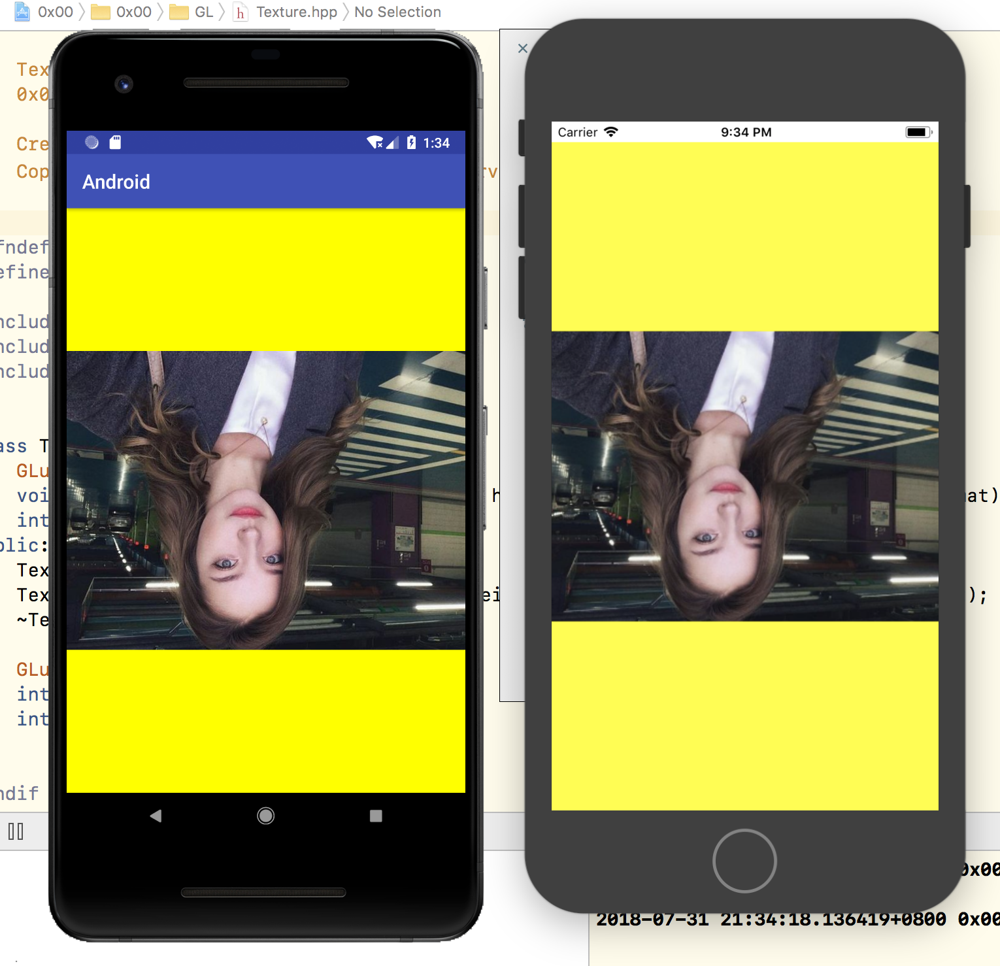
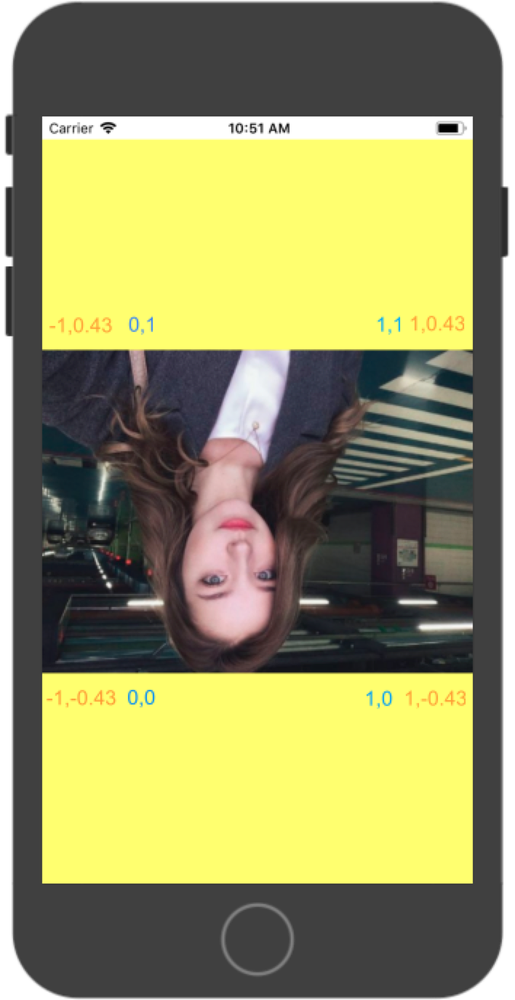
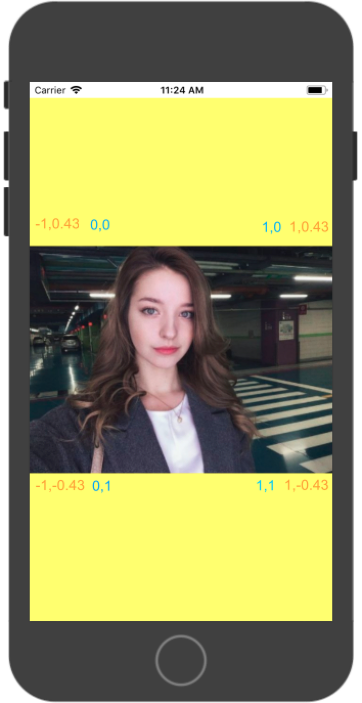
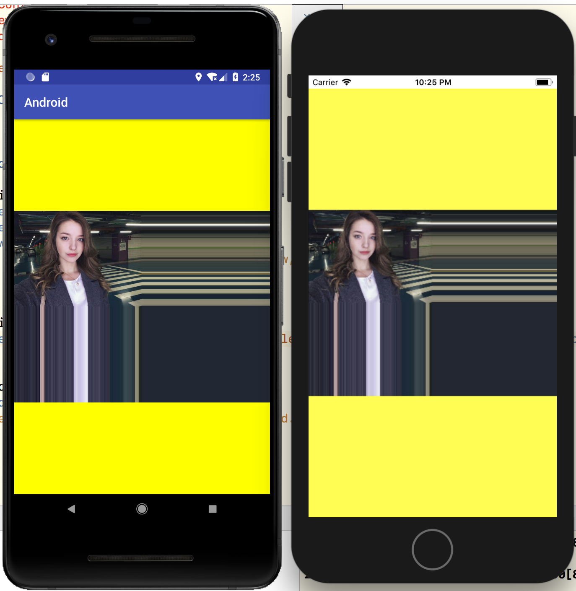
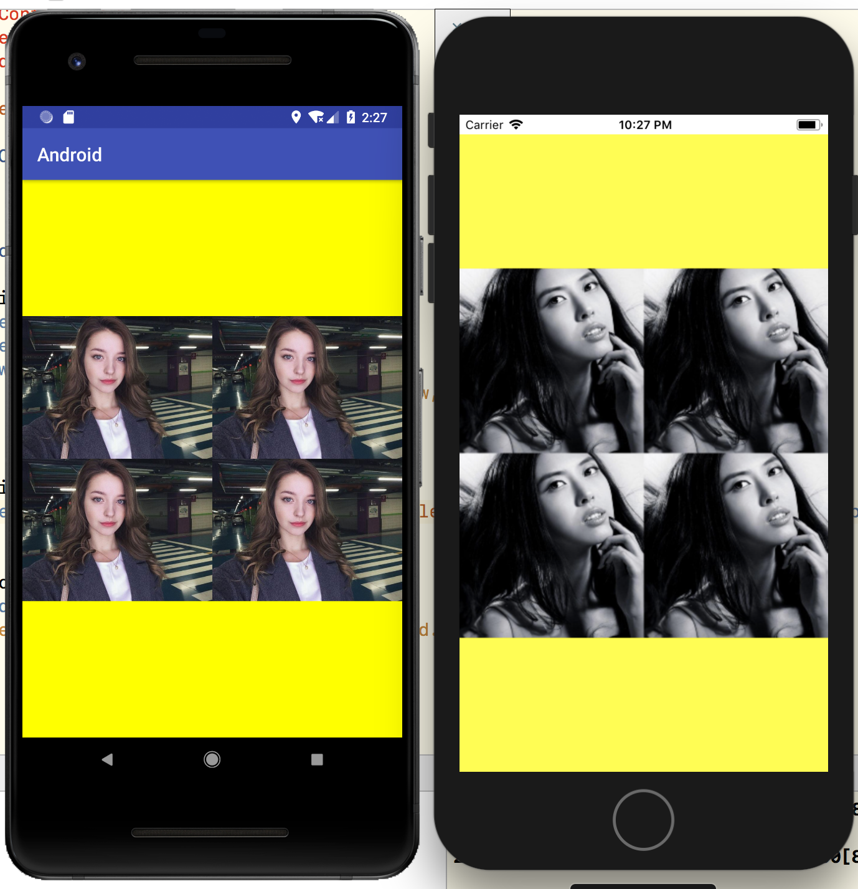
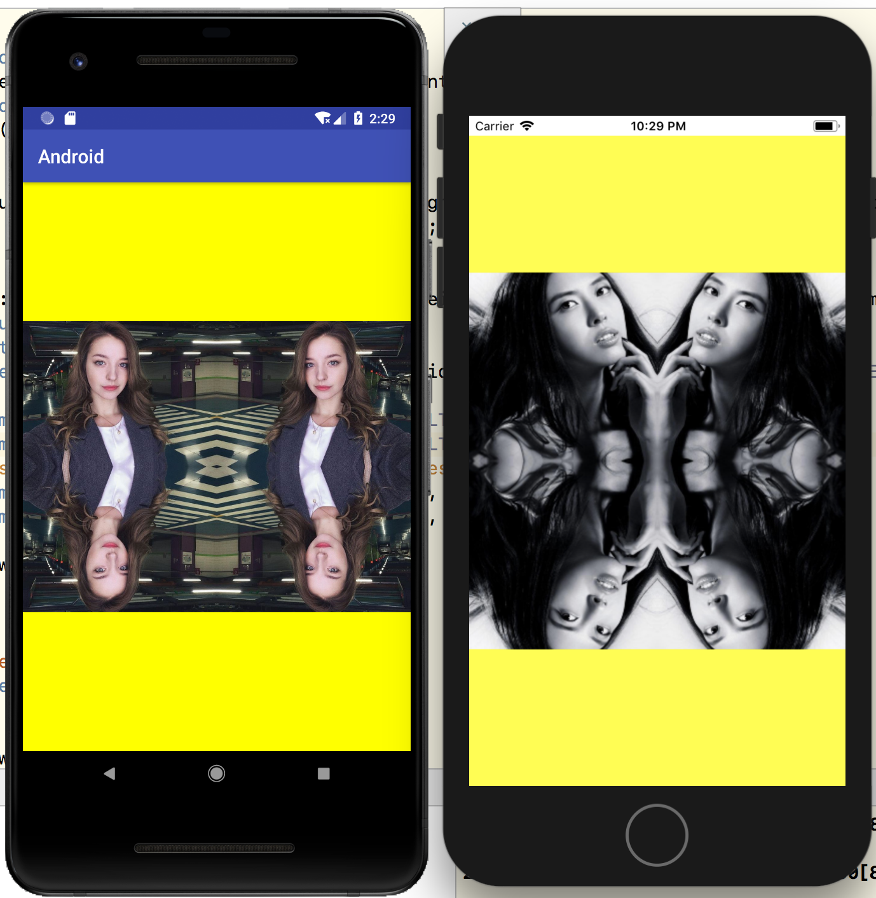
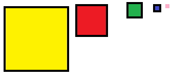
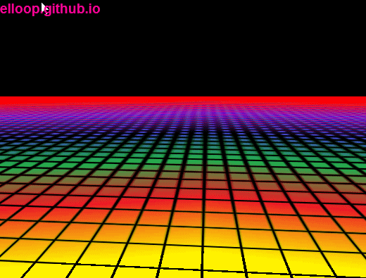

# 纹理

之前的课程我们已经了解到，我们可以为每个顶点添加颜色来创建出有趣的图像。但是，如果想让图形看起来更真实，我们就必须有足够多的顶点，从而指定足够多的颜色。这将会产生很多额外开销，因为每个模型都会需求更多的顶点，每个顶点又需求一个颜色属性。(本文档Mac上建议使用typora打开。本系列分享内容在此[仓库](http://techgit.meitu.com/wzq/OpenGLESLesson)上)

##GL_TEXTURE_2D

GL_TEXTURE_2D是OpenGlES中最基础和普遍的一种纹理结构。（当然对应的还有GL_TEXTURE_1D、GL_TEXTURE_3D）一个GL_TEXTURE_2D纹理，就是图片的数据的一个二维数组。OpenGLES中纹理图像数据可被许多种不同的基本格式描绘（如GL_RGBA）。纹理中每一个独立的数据单元被称为texel(纹素)。

根据图像的基本类型（如：GL_RGBA）和图像的数据类型（如：GL_UNSIGNED_BYTE），决定了图像中的每一个texel。

当渲染纹理时，纹理的坐标将成为索引。GL_TEXTURE_2D纹理的坐标轴分别是（s，t）或者是（u，v）。这个坐标轴是规范化的，即坐标的大小在0.0~1.0之间。**纹理图像的坐标原点为左下角（0.0，0.0）**。

```
纹理坐标轴为什么称之为UV坐标呢？事实上，UV是UVW的缩写，也就是用来表示三维坐标的XYZ轴。
```



为了避免这种尴尬的情况我们需要对纹理坐标进行Y轴变换。






```
注意：除了图像以外，纹理也可以被用来储存大量的数据，这些数据可以传递到片段着色器上处理，但是这不是我们现在关心的。
```


## 环绕模式

纹理坐标的范围通常是从(0, 0)到(1, 1)，超过[0.0,1.0]的范围是允许的，而对与超出范围的内容的操作，取决于纹理的环绕方式（Wrapping mode）

| 环绕方式(Wrapping) | 描述                                                         |
| ------------------ | ------------------------------------------------------------ |
| GL_REPEAT          | 对纹理的默认行为。重复纹理图像。                             |
| GL_MIRRORED_REPEAT | 和GL_REPEAT一样，但每次重复图片是镜像放置的。                |
| GL_CLAMP_TO_EDGE   | 纹理坐标会被约束在0到1之间，超出的部分会重复纹理坐标的边缘，产生一种边缘被拉伸的效果。 |

每个选项都可以使用glTexParameter*函数对单独的一个坐标轴设置（`s`、`t`（如果是使用3D纹理那么还有一个`r`）它们和`x`、`y`、`z`是等价的）：

```
glTexParameteri(GL_TEXTURE_2D, GL_TEXTURE_WRAP_S, GL_MIRRORED_REPEAT);
glTexParameteri(GL_TEXTURE_2D, GL_TEXTURE_WRAP_T, GL_MIRRORED_REPEAT);
```

第一个参数指定了纹理目标类型；我们使用的是2D纹理，因此纹理目标类型是GL_TEXTURE_2D。第二个参数需要我们指定设置纹理轴向。我们打算配置的是`WRAP`选项，并且指定`S`和`T`轴。最后一个参数需要我们传递一个环绕方式，在这个例子中OpenGLES会给当前glBindTexture的纹理设定纹理环绕方式为GL_MIRRORED_REPEAT。

下面是每种Wrapping mode的展示

* GL_CLAMP_TO_EDGE 




* GL_REPEAT

  

细心地你一定发现为啥iOS换了张图？因为iOS GL_REPEAT不支持非2的n次幂的Texture。(右图为512x512)

* GL_MIRRORED_REPEAT



iOS 同样不支持.


## 纹理滤波

纹理坐标不依赖于真实像素坐标，它可以是任意浮点值，所以OpenGLES需要知道怎样将纹素映射到纹理坐标。当你有一个很大的图元但是纹理的分辨率很低的时候这就变得很重要了。你可能已经猜到了，OpenGLES也有对于纹理滤波(Texture Filtering)的选项。


- GL_NEAREST

GL_NEAREST（也叫邻近滤波，Nearest Neighbor Filtering）是OpenGLES默认的纹理过滤方式。当设置为GL_NEAREST的时候，OpenGLES会选择中心点最接近纹理坐标的那个像素。下图中你可以看到四个像素，加号代表纹理坐标。左上角那个纹理像素的中心距离纹理坐标最近，所以它会被选择为样本颜色：


* GL_LINEAR

GL_LINEAR（也叫线性滤波，(Bi)linear Filtering）它会基于纹理坐标附近的纹理像素，计算出一个插值，近似出这些纹理像素之间的颜色。一个纹理像素的中心距离纹理坐标越近，那么这个纹理像素的颜色对最终的样本颜色的贡献越大。下图中你可以看到返回的颜色是邻近像素的混合色：


那么这两种纹理过滤方式有怎样的视觉效果呢？让我们看看在一个很大的图元上应用一张低分辨率的纹理会发生什么吧（纹理被放大了，每个纹理像素都能看到）：

 

GL_NEAREST产生了颗粒状的图案，我们能够清晰看到组成纹理的像素，而GL_LINEAR能够产生更平滑的图案，很难看出单个的纹理像素。GL_LINEAR可以产生更真实的输出，但有些像素风格的游戏，他们会用GL_NEAREST选项。

当进行放大(Magnify)和缩小(Minify)操作的时候可以设置纹理过滤的选项，比如你可以在纹理被缩小的时候使用邻近滤波，被放大时使用线性滤波。我们需要使用glTexParameter*函数为放大和缩小指定滤波方式。这段代码看起来会和纹理环绕方式的设置很相似：

```c
glTexParameteri(GL_TEXTURE_2D, GL_TEXTURE_MIN_FILTER, GL_NEAREST);
glTexParameteri(GL_TEXTURE_2D, GL_TEXTURE_MAG_FILTER, GL_LINEAR);
```


## 生成纹理

和之前生成的OpenGLES对象一样，纹理也是使用ID引用的。让我们来创建一个：

```
GLuint texture;
glGenTextures(1, &texture);
```

glGenTextures函数首先需要输入生成纹理的数量，然后把它们储存在第二个参数的`GLuint`数组中（我们的例子中只是一个单独的`GLuint`），就像其他对象一样，我们需要绑定它，让之后任何的纹理指令都可以配置当前绑定的纹理：

```
glBindTexture(GL_TEXTURE_2D, texture);
```

现在纹理已经绑定了，我们可以使用前面载入的图片数据生成一个纹理了。纹理可以通过glTexImage2D来生成：

```
glTexImage2D(GL_TEXTURE_2D, 0, GL_RGBA, width, height, 0, GL_RGB, GL_UNSIGNED_BYTE, image);
```

函数很长，参数也不少，所以我们一个一个地讲解：

- 第一个参数指定了纹理目标(Target)。设置为GL_TEXTURE_2D意味着会生成与当前绑定的纹理对象在同一个目标上的纹理（任何绑定到GL_TEXTURE_1D和GL_TEXTURE_3D的纹理不会受到影响）。

- 第二个参数为纹理指定Mipmap的级别，如果你希望单独手动设置每个Mipmap的级别的话。这里我们填0，也就是默认级别。

  - Mipmap

    想象一下，假设我们有一个包含着上千物体的大房间，每个物体上都有纹理。有些物体会很远，但其纹理会拥有与近处物体同样高的分辨率。由于远处的物体可能只产生很少的片段，OpenGLES从高分辨率纹理中为这些片段获取正确的颜色值就很困难，因为它需要对一个跨过纹理很大部分的片段只拾取一个纹理颜色。在小物体上这会产生不真实的感觉，更不用说对它们使用高分辨率纹理浪费内存的问题了。

    

  

- 第三个参数告诉OpenGLES我们希望把纹理储存为何种格式。我们的图像只有`RGBA`值，因此我们也把纹理储存为`RGBA`值。

- 第四个和第五个参数设置最终的纹理的宽度和高度。我们之前加载图像的时候储存了它们，所以我们使用对应的变量。

- 下个参数应该总是被设为`0`（历史遗留问题）。

- 第七第八个参数定义了源图的格式和数据类型。我们使用RGB值加载这个图像，并把它们储存为`GL_UNSIGNED_BYTE`(byte)数组，我们将会传入对应值。

- 最后一个参数是真正的图像数据指针。

最后设置纹理的环绕模式与纹理滤波。

```c
    glTexParameteri(GL_TEXTURE_2D, GL_TEXTURE_MIN_FILTER, GL_LINEAR);
    glTexParameteri(GL_TEXTURE_2D, GL_TEXTURE_MAG_FILTER, GL_LINEAR);

    glTexParameteri(GL_TEXTURE_2D, GL_TEXTURE_WRAP_S, GL_CLAMP_TO_EDGE);
    glTexParameteri(GL_TEXTURE_2D, GL_TEXTURE_WRAP_T, GL_CLAMP_TO_EDGE);
```

## 思考题

- 结合上节课的着色器知识，隐藏GL_MIRRORED_REPEAT的右下角区域内容。
- 结合上节课的着色器知识，在着色器里面实现GL_MIRRORED_REPEAT功能（让iOS支持非2的N次幂的图片）。