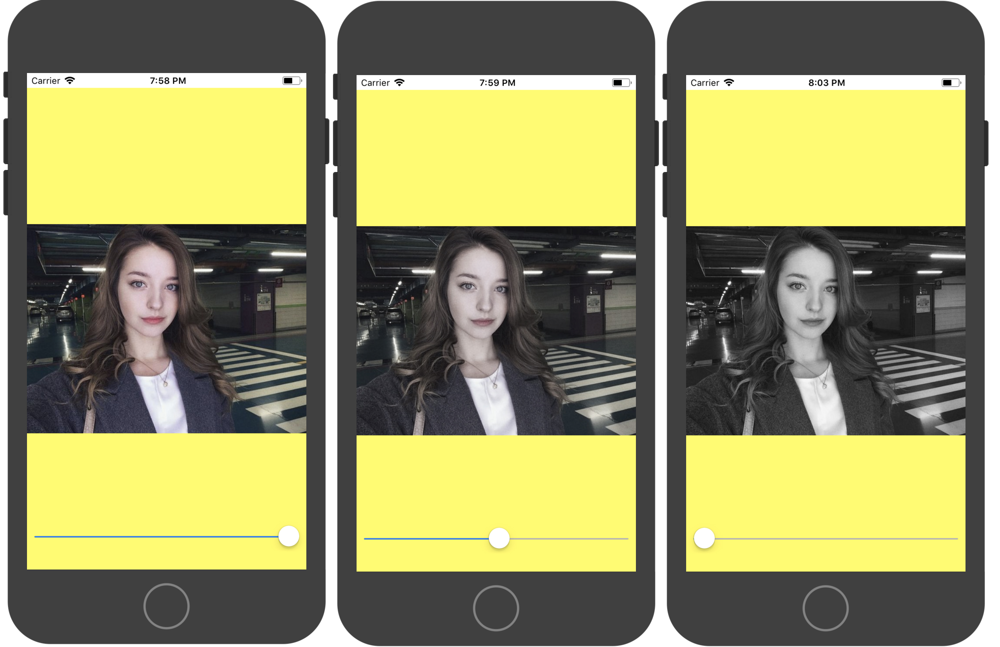
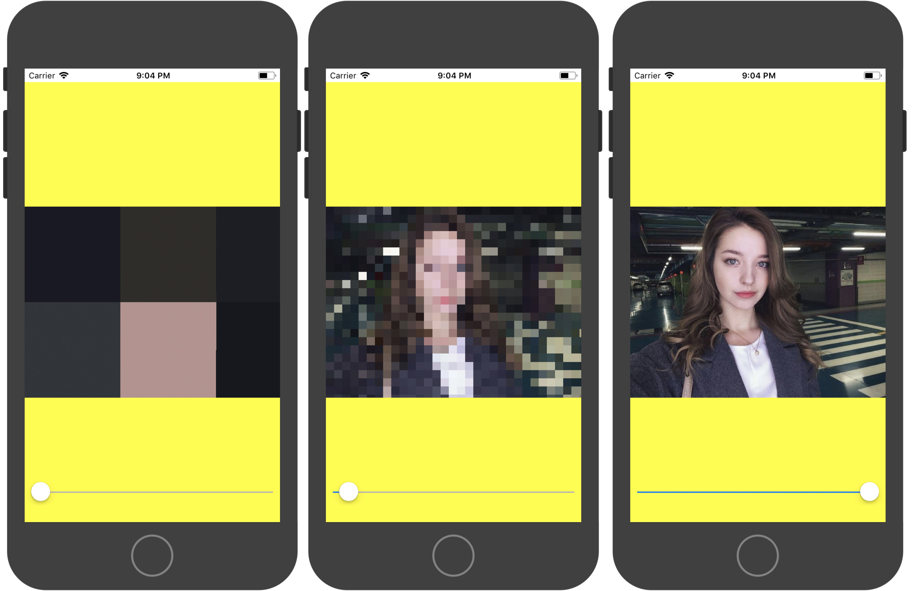

# 简单图像处理

之前的课程我们已经学会了怎么去加载并显示一张图像。但是，目前来看加载一张图片显然不能让我们止步于此。本节课将教大家怎么去做一些常见的图像处理。(本文档Mac上建议使用typora打开。本系列分享内容在此[仓库](http://techgit.meitu.com/wzq/OpenGLESLesson)上)

## 饱和度调整




这个着色器来自 《[图形着色器：理论和实践](http://www.amazon.com/Graphics-Shaders-Theory-Practice-Second/dp/1568814348/ref=sr_1_1?s=books&ie=UTF8&qid=1422557718&sr=1-1&keywords=graphics+shaders+theory+and+practice)》一书，有兴趣的同学可以了解一下。

饱和度是用来表示颜色的亮度和强度的术语。一件亮红色的毛衣的饱和度要远比雾霾时灰色的天空的饱和度高得多。

在这个着色器上，参照人类对颜色和亮度的感知过程，我们有一些优化可以使用。一般而言，人类对亮度要比对颜色敏感的多。这么多年来，压缩软件体积的一个优化方式就是减少存储颜色所用的内存。

人类不仅对亮度比颜色要敏感，同样亮度下，我们对某些特定的颜色反应也更加灵敏，尤其是绿色。这意味着，当你寻找压缩图片的方式，或者以某种方式改变它们的亮度和颜色的时候，多放一些注意力在绿色光谱上是很重要的，因为我们对它最为敏感。

```c
precision highp float;

varying vec2 inputTexcoord;
uniform sampler2D texture;
uniform float progress;

const mediump vec3 luminanceWeighting = vec3(0.2125, 0.7154, 0.0721);

void main()
{
    lowp vec4 textureColor = texture2D(texture, inputTexcoord);
    lowp float luminance = dot(textureColor.rgb, luminanceWeighting);
    lowp vec3 greyScaleColor = vec3(luminance);
    
    gl_FragColor = vec4(mix(greyScaleColor, textureColor.rgb, progress), textureColor.w);
    
}
```

这个例子中我们有一个新的 uniform 的变量需要处理，那就是progress。progress的数值是一个我们从用户界面设置的参数。我们需要知道用户需要多少饱和度，从而展示正确的颜色数量。

```c
const mediump vec3 luminanceWeighting = vec3(0.2125, 0.7154, 0.0721);
```

这就是我们设置三个元素的向量，为我们的亮度来保存颜色比重的地方。这三个值加起来要为 1，这样我们才能把亮度计算为 0.0 - 1.0 之间的值。注意中间的值，就是表示绿色的值，用了 70% 的颜色比重，而蓝色只用了它的 10%。蓝色对我们的展示不是很好，把更多权重放在绿色上是很有意义的。

```c
lowp float luminance = dot(textureColor.rgb, luminanceWeighting);
```

点乘计算以包含纹理颜色信息的 `vec4` 为参数，舍弃 `vec4` 的最后一个不需要的元素，将它和相对应的亮度权重相乘。然后取出所有的三个值把它们加在一起，计算出这个像素综合的亮度值。

```c
lowp vec3 greyScaleColor = vec3(luminance);
```

我们创建一个三个值都是亮度信息的 `vec3`。向我们之前课程了解的如果你只指定一个值，编译器会帮你把该将向量中的每个分量都设成这个值。

```c
gl_FragColor = vec4(mix(greyScaleColor, textureColor.rgb, progress), textureColor.w);
```

最后，我们把所有的片段组合起来。为了确定每个新的颜色是什么，我们使用刚刚学过的很好用的 mix 函数。mix 函数会把我们刚刚计算的灰度值和初始的纹理颜色以及我们得到的饱和度的信息相结合。

这就是一个很棒的，好用的着色器，它让你用主函数里的四行代码就可以把图片从彩色变到灰色，或者从灰色变到彩色。


## 马赛克



马赛克（英语：Mosaic）是镶嵌艺术的音译，原本是指一种装饰艺术，通常使用许多小石块或有色玻璃碎片拼成图案，在教堂中的玻璃艺品，又称为花窗玻璃（stained glass）。后来该词（马赛克）泛指这种类型五彩斑斓的视觉效果。

在计算机图形学里，马赛克技术是一种利用与镶嵌画装饰艺术类似原理的影像处理方法。此方法将影像特定区域的色阶细节劣化并造成色块打乱的效果，其目的是为了使另一个人无法辨认。

```c
precision highp float;

varying vec2 inputTexcoord;
uniform sampler2D texture;
uniform float progress;

const float mosaicSize = 800.0;

void main() {
    float blockSize = max(progress * mosaicSize, 2.0);
    vec2 mosaicTexcoord = inputTexcoord * blockSize;
    mosaicTexcoord = floor(mosaicTexcoord);
    vec4 color = texture2D(texture, mosaicTexcoord / blockSize);
    gl_FragColor = color;
}
```

我们先假定一个马赛克的最大个数常量

```c
const float mosaicSize = 800.0;
```

通过乘以progress来动态生成马赛克（最小不得少于两个）

```c
float blockSize = max(progress * mosaicSize, 2.0);
```

将当前纹理坐标乘以马赛克块个数并取下整，确定当前马赛克块应该取的图片像素坐标。

```c
vec2 mosaicTexcoord = inputTexcoord * blockSize;
mosaicTexcoord = floor(mosaicTexcoord);
```

最后将坐标格式化为0~1后获取纹理对应颜色

```c
vec4 color = texture2D(texture, mosaicTexcoord / blockSize);
```

[iOS多边形马赛克的实现（上）](https://cloud.tencent.com/developer/article/1035465)

[iOS多边形马赛克的实现（下）](https://cloud.tencent.com/developer/article/1035452)

## GPUImageX

这里直接引用iOS原始版本的[GPUImage](https://github.com/BradLarson/GPUImage)官方描述： The GPUImage framework is a BSD-licensed iOS library that lets you apply GPU-accelerated filters and other effects to images, live camera video, and movies. In comparison to Core Image (part of iOS 5.0), GPUImage allows you to write your own custom filters, supports deployment to iOS 4.0, and has a simpler interface. However, it currently lacks some of the more advanced features of Core Image, such as facial detection.

内容大意为：GPUImage是使用GPU处理图像的、他可以对图片、实时画面、视频进行处理。他允许你自定义滤镜、支持iOS4.0。然而,目前缺乏核心形象的一些更高级的功能,比如面部检测。

GPUImage是一个基于GPU图像和视频处理的开源iOS框架，提供各种各样的图像处理滤镜，并且支持照相机和摄像机的实时滤镜； 基于GPU的图像加速，因此可以加速对实时摄像头视频、Movie以及image的滤镜和其它效果处理，并且能够自定义图像滤镜。

使用GPUImage处理图片比Core Image更简单，只需要将滤镜与图片对象串联即可，不用考虑context或者设备等其他问题。GPUImage提供了除高斯模糊外的其他几种不同效果的模糊，虽然Core Image也提供了几种模糊效果，但目前在iOS上能用的就只有高斯模糊，而GPUImage可用的有FastBlur, GaussianBlur, GaussianSelectiveBlur 和 BoxBlur。GPUImage还支持自定义滤镜。

官方GPUImagePicture例子：

```objective-c
UIImage *inputImage = [UIImage imageNamed:@"Lambeau.jpg"];

GPUImagePicture *stillImageSource = [[GPUImagePicture alloc] initWithImage:inputImage];
GPUImageSepiaFilter *stillImageFilter = [[GPUImageSepiaFilter alloc] init];

[stillImageSource addTarget:stillImageFilter];
[stillImageFilter useNextFrameForImageCapture];
[stillImageSource processImage];

UIImage *currentFilteredVideoFrame = [stillImageFilter imageFromCurrentFramebuffer];
```

GPUImageX支持使用C++重写了GPUImage的核心逻辑功能并对部分功能做出优化，支持iOS与安卓。